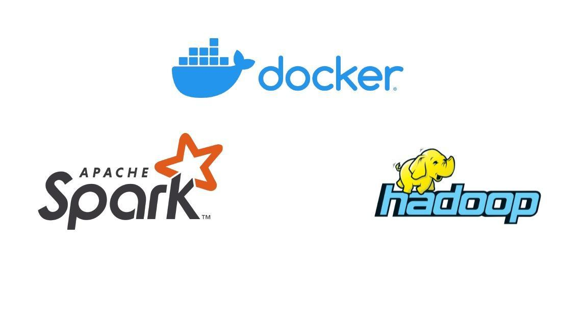

# Docker hadoop yarn cluster for spark 3.0.1

<p align="center">
  
</p>
<p>
Created a docker container based spark,yarn ,hadoop cluster with one master and two slaves.

inspired by Pierre Kieffer . https://github.com/PierreKieffer/docker-spark-yarn-cluster

upgraded to latest version of spark etc.

pyspark using spark version 3.0.1 open JDK 64-bit Version 11.0.9.1

hadoop version 3.3.0 scala version 2.11.12 conda version 3.9.1 python version 3.8.3 gcc 7.3.0 torch version 1.7.0
</p>

Provides Docker multi-nodes Hadoop cluster with Spark 3.0.1 on Yarn.


* [Usage](#usage)
	* [Build](#build)
	* [Run](#run)
	* [Stop](#stop)
	* [Connect to Master Node](#connect-to-master-node)
	* [Run spark applications on cluster :](#run-spark-applications-on-cluster-)
		* [spark-shell](#spark-shell)
		* [spark submit](#spark-submit)
		* [Web UI](#web-ui)


## Usage
### Build
```bash
make build
```
### Run
```bash
make start
```
### Stop
```bash
make stop
```
### Connect to Master Node
```bash
make connect
```
```bash
 ---- MASTER NODE ----
root@cluster-master:/#
```
### Run spark applications on cluster :
Once connected to the master node

#### spark-shell
```bash
spark-shell --master yarn --deploy-mode client
```
#### spark submit
```bash
spark-submit --master yarn --deploy-mode [client or cluster] --num-executors 2 --executor-memory 4G --executor-cores 4 --class ```
#### Web UI
- Get master node ip:
```bash
make master-ip
```
```bash
 ---- MASTER NODE IP ----
Master node ip : 172.20.0.4
```
- Access to Hadoop cluster Web UI : `master-node-ip:8088`
- Access to spark Web UI : `master-node-ip:8080`
- Access to hdfs Web UI : `master-node-ip:50070`
